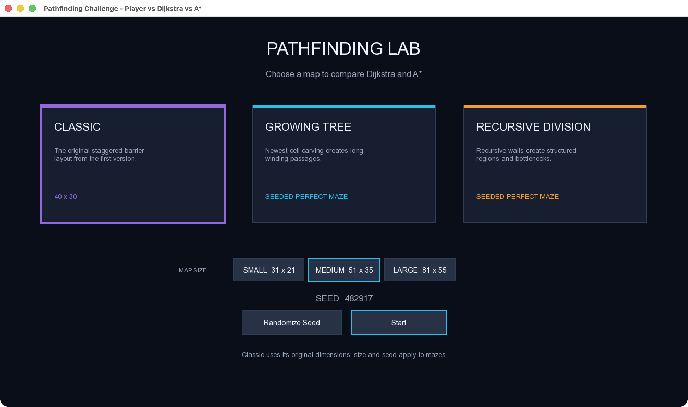
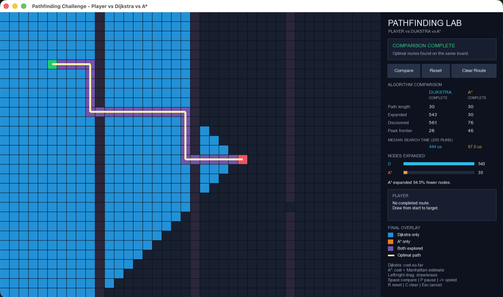
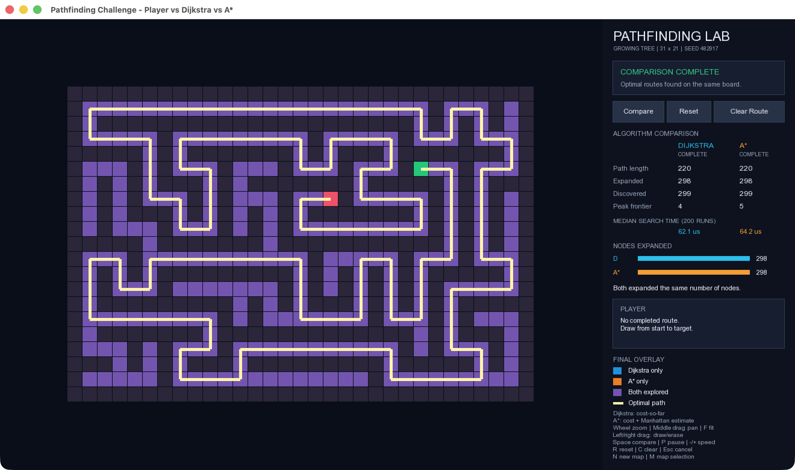
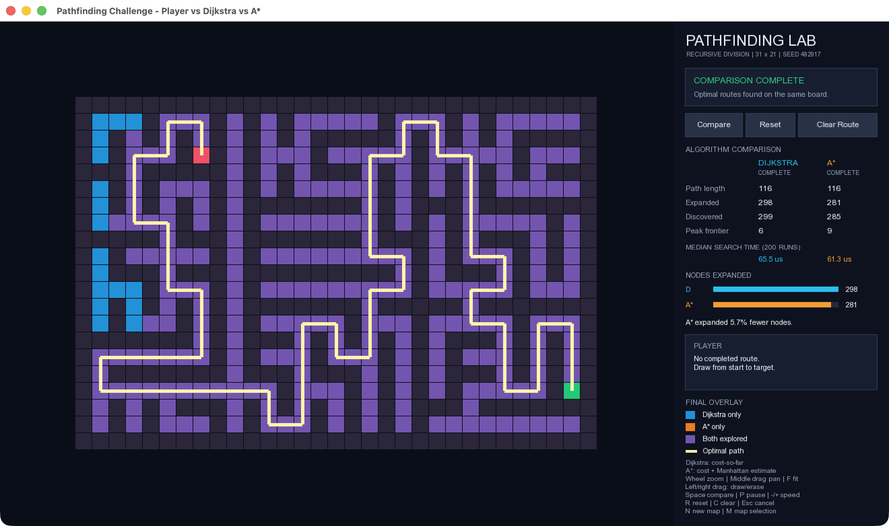

# Pathfinding Challenge — Player vs. Dijkstra vs. A*

An interactive C++17/SFML visualizer for comparing two optimal pathfinding algorithms across a hand-authored board and seeded procedural mazes. Draw your own route, replay Dijkstra and A* step by step, and compare their exploration patterns, optimal paths, and repeated-run benchmarks.



## Maps and Maze Generation

The application opens on a map-selection screen with three map families. Different topologies produce different search patterns, making it possible to compare how Dijkstra and A* explore the same kind of problem under very different corridor and barrier structures.

### Classic

The original 40×30 staggered-barrier layout from the first version of the project. Its fixed endpoints and three vertical walls provide a clear demonstration of A* directing substantially less work toward the target.



### Growing Tree

A perfect maze generated by maintaining an active list of logical cells and always extending the newest cell when possible. This recursive-backtracking-style selection produces long, winding corridors. The raster uses odd coordinates for logical cells and carves the wall between each newly connected pair.

### Recursive Division

A perfect maze generated by starting with an open interior and recursively adding walls. Regions split along their longer dimension; walls use even coordinates and retain one odd-coordinate gap. The result has more visibly structured regions and bottlenecks than Growing Tree.

| Growing Tree | Recursive Division |
| --- | --- |
|  |  |

Procedural maps are available in three odd-dimension presets:

| Preset | Dimensions |
| --- | --- |
| Small | 31×21 |
| Medium | 51×35 |
| Large | 81×55 |

After generation, a two-pass breadth-first search places the start and target at distant reachable cells.

## Reproducible Seeds

Every procedural maze is generated from the numeric seed displayed in the selector and side panel. The same generator, dimensions, and seed recreate the same obstacle layout and endpoints.

For example:

```text
Growing Tree
81×55
Seed: 482917
```

Use **Randomize Seed** before starting, or press `N` in the game to generate a new seed and rebuild the current procedural map. `N` reloads the unchanged original layout in Classic mode.

## Player vs. Algorithms

1. Select a map family, maze size, and seed, then click **Start**.
2. Draw a route from the emerald start cell to the coral target cell, or compare immediately.
3. Press `Space` or click **Compare**.
4. Dijkstra replays its frontier, expanded region, and reconstructed shortest path.
5. The board returns to its permanent colors before A* runs on the same map.
6. The final view combines both expanded regions, draws the optimal paths, and reports search and benchmark metrics.

Player-path cells are traversable annotations, not walls. Only permanent obstacle cells block either algorithm. When a player route is complete, the panel reports its length, steps above optimal, and efficiency:

```text
efficiency = optimal path length / player route length × 100
```

## Algorithms

### Dijkstra

Dijkstra prioritizes the smallest known cost from the start:

```text
priority(n) = g(n)
```

Every four-directional edge costs one, so its search expands uniformly outward until it reaches the target.

### A*

A* combines cost from the start with an estimate to the goal:

```text
f(n) = g(n) + h(n)
h(n) = Manhattan distance to the target
```

Manhattan distance is admissible and consistent for this unit-cost, four-directional grid. A* therefore retains optimality while often directing more of its work toward the target. In some perfect-maze topologies there may be few useful alternatives to prune, so the two algorithms can expand similar regions; that contrast is part of the comparison.

Both implementations use immutable priority-queue entries, deterministic tie-breaking, stale-entry skipping, and independent metadata resets. Repeated comparisons therefore remain stable on the same map.

## Reading the Visualization

During each replay, a bright frontier color marks newly discovered cells and a deeper color marks expanded cells. The optimal route appears after exploration finishes.

The final overlay uses:

- Cyan/blue: expanded only by Dijkstra
- Orange: expanded only by A*
- Violet: expanded by both algorithms
- Warm continuous line: shared optimal-path segments
- Thin cyan/orange lines: algorithm-specific segments when equally short paths differ

Start, target, obstacles, and player-path semantics remain intact throughout animation. Search traces store coordinates rather than pointers and never mutate permanent `NodeType` values.

## Comparison Metrics

| Metric | Definition |
| --- | --- |
| Path length | Number of edges in the reconstructed route (`path.size() - 1`) |
| Discovered | Unique cells that first receive a finite best-known cost and enter the logical frontier |
| Expanded | Unique cells whose current-best entry is removed and whose neighbors are processed |
| Peak frontier | Largest number of unique active frontier cells, excluding stale queue duplicates |
| Median search time | Median full-search duration from repeated, non-animated runs |

Expanded nodes are the primary educational comparison because they quantify search work and remain stable across machines. Runtime is secondary and can vary between runs.

## Benchmark Methodology

The benchmark is separate from animation time and runs once after both visual replays finish.

- 10 warm-up runs per algorithm
- 200 measured runs per algorithm
- Trace/event capture disabled
- Full search and path reconstruction included
- Pathfinding metadata reset by every solver invocation
- Same map, start, target, and player-path state for every run
- Dijkstra/A* measurement order alternated between samples
- `std::chrono::steady_clock` durations summarized by the median

The panel labels the result as `MEDIAN SEARCH TIME (200 RUNS)`. Absolute timings depend on the CPU, compiler, build type, operating-system scheduling, and other machine activity. Use a Release build when comparing them.

## Controls

### Map selection

| Input | Action |
| --- | --- |
| Click map card | Select Classic, Growing Tree, or Recursive Division |
| Click size | Select Small, Medium, or Large for procedural maps |
| Randomize Seed | Choose and display a new procedural seed |
| Start | Build the selected map and enter the game |
| Escape | Close the application |

Classic retains its original dimensions and ignores the maze-size and seed options.

### Game

| Input | Action |
| --- | --- |
| Left mouse drag | Draw player-route cells |
| Right mouse drag | Erase player-route cells |
| Mouse wheel | Zoom at the cursor |
| Middle mouse drag | Pan the world view |
| F | Fit the complete map in the board viewport |
| Space | Run or repeat the Dijkstra → A* comparison |
| P | Pause or resume visualization |
| - / + | Decrease or increase visualization speed |
| R | Reset visualization/results while preserving the player route |
| C | Clear player route, visualization, and results |
| Escape | Cancel visualization and return to editing |
| N | Generate a new procedural maze or reload Classic |
| M | Safely unload the current map and return to map selection |

The side panel also provides **Compare**, **Reset**, and **Clear Route** buttons. Camera input remains available during animation, while editing is limited to the board viewport. Start, target, and obstacle cells cannot be overwritten. Fast drag input is interpolated between cells so strokes do not develop accidental gaps.

## Build and Run

Requirements:

- CMake 3.28 or newer
- A C++17 compiler
- SFML 3 Graphics

On macOS with Homebrew:

```bash
brew install sfml
```

Recommended Release build:

```bash
cmake -S . -B build-release -DCMAKE_BUILD_TYPE=Release
cmake --build build-release --parallel
ctest --test-dir build-release --output-on-failure
./build-release/PathfindingGame
```

For a normal local development build:

```bash
cmake -S . -B build
cmake --build build --parallel
ctest --test-dir build --output-on-failure
./build/PathfindingGame
```

CMake copies the `assets` directory beside the application after every build.

## Architecture

One move-owned `LoadedMap` contains the authoritative dynamic grid, endpoint pointers, and active `MapConfig`. Map creation is centralized so switching maps first builds a complete replacement and then clears all player, comparison, benchmark, overlay, pause, and animation state. Pathfinding, drawing, overlays, and coordinate conversion derive dimensions from the active grid rather than fixed row/column constants.

The game uses separate SFML views: a clipped world view for the map and a fixed UI view for the side panel and selector.

```text
include/PathfindingGame.h       Dynamic grid, search results, metrics, solver APIs
src/PathfindingGame.cpp         Grid lifetime, editing, Dijkstra, A*, benchmark
include/MapGeneration.h         Map configuration, ownership, generator APIs
src/MapGeneration.cpp           Classic, Growing Tree, Recursive Division, endpoints
include/MapSelectionUI.h        Selector state, actions, size presets
src/MapSelectionUI.cpp          Selector cards, buttons, seed display
include/PathfindingAnimation.h  Game states, replay and overlay models
src/PathfindingAnimation.cpp    Non-blocking replay and final path rendering
include/ComparisonUI.h          Side-panel model and actions
src/ComparisonUI.cpp            Panel, metrics, controls, legend
src/Main.cpp                    Screens, camera, input, lifecycle, rendering
tests/PathfindingGameTests.cpp  Unit and cross-map integration tests
```

The frame loop polls events, advances clock-based animation steps, renders world-space content, restores the UI view, and draws the fixed interface. No sleeps, busy waits, UI framework, or additional rendering dependency are used.

## Testing

The CTest executable covers:

- Classic-layout regression and safe map replacement
- Growing Tree and Recursive Division determinism, connectivity, parity, and structural distinction
- All three size presets and distant endpoint selection
- Dijkstra/A* optimality, valid metrics, and repeated runs on every selectable map
- Dynamic player-path detection, editing, and coordinate conversion
- Animation completion and logical-state safety on every selectable map
- Arbitrary-dimension comparison overlays and final path segments
- Selector and comparison-panel actions and state text
- Benchmark lifecycle, largest-preset production workload, and permanent-grid preservation
- Invalid dimensions, no-path behavior, and stale-parent reset

Run it directly through CTest:

```bash
ctest --test-dir build-release --output-on-failure
```
